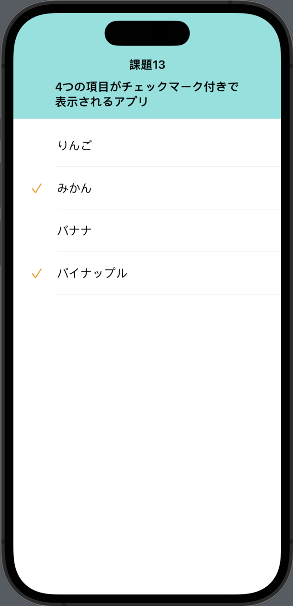

# 課題13 4つの項目がチェックマーク付きで表示されるアプリ
## Overview
<ul>
<li>4つのフルーツ名がリスト形式で表示される。</li>
<li>フルーツ名にはチェックマークが付いているものと付いていないものがある</li>
</ul>

<h2>Memo</h2>
<ul>
<li>SwiftUI</li>
<li>List</li>
<li>Label</li>
<li>Identifiable</li>
<li>ObservableObject/ObservedObject</li>
<li>チェックマーク非表示の処理はアイコンを""でよかったのか疑問。</lu>
</ul>

